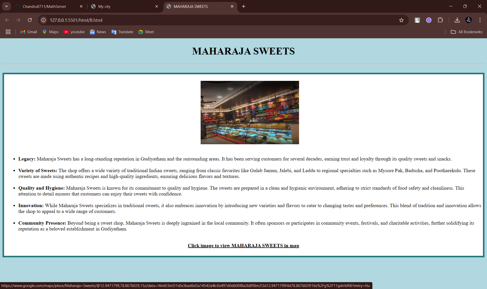

# Ex04 Places Around Me
# Date:5/10/24
# AIM
To develop a website to display details about the places around my house.

# DESIGN STEPS
## STEP 1
Create a Django admin interface.

## STEP 2
Download your city map from Google.

## STEP 3
Using <map> tag name the map.

## STEP 4
Create clickable regions in the image using <area> tag.

## STEP 5
Write HTML programs for all the regions identified.

## STEP 6
Execute the programs and publish them.

# CODE
# VIEWS.PY
```
from django.shortcuts import render

# Create your views here.
def index(request):
    return render(request,'index.html')
```
# TEMPLATES
##INDEX.HTML
```
<!DOCTYPE html>
<html lang="en">
<head>
    <meta charset="UTF-8">
    <meta name="viewport" content="width=device-width, initial-scale=1.0"> 
    <title>My city</title>
<body>
<h1 align="center">
<font color="blue"><b>Gudiyatham</b></font>
</h1>
<h3 align="center"> 
<font color="black"><b>prabanjan.m(24900428)</b></font>
</h3>
<centre>
<h4 align="center">
<map name="MyCity">
    
    <map name="image-map">
        <area target="_blank" alt="IMAGEMAP" title="IMAGEMAP" href="A.html" coords="773,492,902,427" shape="rect">
        <area target="_blank" alt="SAKTHI CINEMAS" title="SAKTHI CINEMAS" href="C.html" coords="617,580,762,509" shape="rect">
        <area target="_blank" alt="SENGUNTHAR MAHAL A/C" title="SENGUNTHAR MAHAL A/C" href="D.html" coords="248,698,471,633" shape="rect">
        <area target="_blank" alt="MAHARAJA SWEETS" title="MAHARAJA SWEETS" href="B.html" coords="643,225,819,162" shape="rect">
        <area target="_blank" alt="GANGAIAMMAN TEMPLE" title="GANGAIAMMAN TEMPLE" href="E.html" coords="416,412,645,321" shape="rect">
    </map>
</h4>
</map>
</centre>
</body>
</head>
</html>
```
## URLS.PY
```
from django.contrib import admin
from django.urls import path
from imap import views
urlpatterns = [
    path('admin/', admin.site.urls),
    path("",views.index,name="ds")
]
```
## A.HTML\
```
<head>
    <meta charset="UTF-8">
    <meta name="viewport" content="width=device-width, initial-scale=1.0">
    <title>GUDIYATHAM</title>
    <link rel="stylesheet" href="css.css">
</head>
<body class="alb">
    <h1 class="h">GUDIYATHAM</h1>
    <hr>
    <br>
    <div class="aldiv" style="margin: 0 auto;">  
        <ul>
            <a href="https://www.google.com/maps/place/Gudiyatham,+Tamil+Nadu/@12.9462115,78.8419843,13z/data=!4m15!1m8!3m7!1s0x3bad6d361be288b5:0x88f9feef00e8cd73!2sGudiyatham,+Tamil+Nadu!3b1!8m2!3d12.9427995!4d78.8681614!16zL20vMDZ4bDly!3m5!1s0x3bad6d361be288b5:0x88f9feef00e8cd73!8m2!3d12.9427995!4d78.8681614!16zL20vMDZ4bDly?entry=ttu">
                
            </a>
            <br><br>
            <li><strong>Location:</strong> Gudiyatham is situated in the Vellore district of Tamil Nadu, India, near the border with Andhra Pradesh.</li>
            <br>
            <li><strong>History: </strong> The town has a rich historical background, having been ruled by various dynasties including the Cholas, Pallavas, Vijayanagara Empire, and the Nawabs of Arcot.</li>
            <br>
            <li><strong>Economy: </strong> Gudiyatham's economy is primarily based on agriculture, with crops like rice, sugarcane, and mangoes being significant. Small-scale industries also contribute to the local economy.</li>
            <br>
            <li><strong>Culture: </strong>Gudiyatham boasts a diverse cultural heritage, influenced by its historical past and the mix of various communities living in the region. The town celebrates various festivals and events throughout the year.</li>
            <br>
            <li><strong>Tourism:</strong> While not a major tourist destination, Gudiyatham does have historical sites such as temples, forts, and mosques, reflecting the region's diverse religious and architectural influences.</li>
        </ul>
        <br>
        <center><b><u>Click image to view GUDIYATHAM in map</u></b></center>
        <br>
    </div>
</body>
</html>
```
## B.HTML
```

<!DOCTYPE html>
<html lang="en">
<head>
    <meta charset="UTF-8">
    <meta name="viewport" content="width=device-width, initial-scale=1.0">
    <title>MAHARAJA SWEETS</title>
    <link rel="stylesheet" href="css.css">
</head>
<body class="alb">
    
            <h1 class="h">MAHARAJA SWEETS</h1>
        <hr>
        <br>
        <div class="aldiv" >  
            <ul>
                <a href="https://www.google.com/maps/place/Maharaja+Sweets/@12.9471799,78.8676029,15z/data=!4m6!3m5!1s0x3bad6d3a14542a4b:0x497d0db00f8a2b8f!8m2!3d12.9471799!4d78.8676029!16s%2Fg%2F11gdrrbf06?entry=ttu">
                    
                </a>
                <br><br>
                <li><strong>Legacy:</strong> Maharaja Sweets has a long-standing reputation in Gudiyatham and the surrounding areas. It has been serving customers for several decades, earning trust and loyalty through its quality sweets and snacks.</li>
                <br>
                <li><strong>Variety of Sweets:</strong> The shop offers a wide variety of traditional Indian sweets, ranging from classic favorites like Gulab Jamun, Jalebi, and Laddu to regional specialties such as Mysore Pak, Badusha, and Pootharekulu. These sweets are made using authentic recipes and high-quality ingredients, ensuring delicious flavors and textures.</li>
                <br>
                <li><strong>Quality and Hygiene:</strong>  Maharaja Sweets is known for its commitment to quality and hygiene. The sweets are prepared in a clean and hygienic environment, adhering to strict standards of food safety and cleanliness. This attention to detail ensures that customers can enjoy their sweets with confidence.</li>
                <br>
                <li><strong>Innovation: </strong> While Maharaja Sweets specializes in traditional sweets, it also embraces innovation by introducing new varieties and flavors to cater to changing tastes and preferences. This blend of tradition and innovation allows the shop to appeal to a wide range of customers.</li>
                <br>
                <li><strong>Community Presence:</strong>  Beyond being a sweet shop, Maharaja Sweets is deeply ingrained in the local community. It often sponsors or participates in community events, festivals, and charitable activities, further solidifying its reputation as a beloved establishment in Gudiyatham.</li>
            </ul>
            <br>
            <center><b><u>Click image to view MAHARAJA SWEETS in map</u></b></center>
            <br>
        </div>
</body>
</html>
```
## C.HTML
```

<!DOCTYPE html>
<html lang="en">
<head>
    <meta charset="UTF-8">
    <meta name="viewport" content="width=device-width, initial-scale=1.0">
    <title>SAKTHI CINEMAS</title>
    <link rel="stylesheet" href="css.css">
</head>
<body class="alb">
    
            <h1 class="h">SAKTHI CINEMAS</h1>
        <hr>
        <br>
        <div class="aldiv" >  
            <ul>
                <a href="https://www.google.com/maps/place/Sakthi+Cinemas/@12.9409754,78.8668366,17z/data=!3m1!4b1!4m6!3m5!1s0x3bad6d9bb2196d47:0xff6fb21c97a2c538!8m2!3d12.9409754!4d78.8668366!16s%2Fg%2F11qqx42zg8?entry=ttu">
                    
                </a>
                <br><br>
                <li> 
                    Sakthi Cinemas in Gudiyatham is a popular movie theater located in Gudiyatham, Tamil Nadu, India. It is known for providing entertainment through screenings of the latest movies across various genres. The theater likely offers state-of-the-art facilities, including comfortable seating, high-quality sound systems, and projection technology to enhance the movie-watching experience for its audience.
                    
                    Sakthi Cinemas may also feature multiple screens, allowing for the simultaneous screening of different films and accommodating a larger number of patrons. Additionally, it might offer amenities such as concessions stands selling snacks and beverages to enhance the movie-going experience.
                    
                    As with many cinemas, Sakthi Cinemas likely plays a significant role in the local community, serving as a gathering place for residents to enjoy the latest films and socialize with friends and family. It could also host special events, premieres, or screenings of regional and cultural films to cater to diverse audience preferences.
                    
                    Overall, Sakthi Cinemas in Gudiyatham likely contributes to the cultural and entertainment landscape of the region by providing a platform for people to engage with cinema and enjoy a shared communal experience.</li>
                <br>
            </ul>
            <br>
            <center><b><u>Click image to view SAKTHI CINEMAS in map</u></b></center>
            <br>
        </div>
</body>
</html>
```
## D.HTML
```

<!DOCTYPE html>
<html lang="en">
<head>
    <meta charset="UTF-8">
    <meta name="viewport" content="width=device-width, initial-scale=1.0">
    <title>SENGUNTHAR MAHAL A/C</title>
    <link rel="stylesheet" href="css.css">
</head>
<body class="alb">
    
            <h1 class="h">SENGUNTHAR MAHAL A/C</h1>
        <hr>
        <br>
        <div class="aldiv" >  
            <ul>
                <a href="https://www.google.com/maps/place/Sengunthar+Mahal+A%2FC/@12.93905,78.8613868,15z/data=!4m6!3m5!1s0x3bad6d35f024f949:0xc1691c4314200c06!8m2!3d12.93905!4d78.8613868!16s%2Fg%2F1hc17dx7b?entry=ttu">
                    
                </a>
                <br><br>
                <li> 
                    As of my last update in January 2022, I don't have specific information about a venue called "Sengunthar Mahal A/C" in Gudiyatham. However, based on the name, it sounds like it could be an air-conditioned hall or venue owned or operated by the Sengunthar community in Gudiyatham, Tamil Nadu, India.

These types of halls or venues are often used for various events such as weddings, receptions, cultural gatherings, meetings, and other social functions. They typically offer amenities like spacious halls, air conditioning (as indicated in the name), seating arrangements, catering services, and other facilities required for hosting events.

Sengunthar Mahal A/C could be an important cultural and social center for the Sengunthar community in Gudiyatham, providing a space for community events, celebrations, and gatherings. Such venues often play a significant role in fostering community bonds, preserving cultural traditions, and facilitating social interactions among community members.

If you're interested in learning more about Sengunthar Mahal A/C in Gudiyatham, I would recommend reaching out to local community organizations, event planners, or conducting a search online for more specific information about its location, facilities, and services offered.</li>
                <br>
            </ul>
            <br>
            <center><b><u>Click image to view SENGUNTHAR MAHAL A/C in map</u></b></center>
            <br>
        </div>
</body>
</html>
```
##E.HTML
```
<!DOCTYPE html>
<html lang="en">
<head>
    <meta charset="UTF-8">
    <meta name="viewport" content="width=device-width, initial-scale=1.0">
    <title>GANGAIAMMAN TEMPLE</title>
    <link rel="stylesheet" href="css.css">
</head>
<body class="alb">
    
            <h1 class="h">GANGAIAMMAN TEMPLE</h1>
        <hr>
        <br>
        <div class="aldiv" >  
            <ul>
                <a href="https://www.google.com/maps/place/Arulmigu+Sri+Gudiyatham+Gangai+Amman+Temple/@12.9441768,78.8260147,14z/data=!4m10!1m2!2m1!1sgangaiamman+gudiyatham!3m6!1s0x3bad6d370a47e065:0x4d1352f1ffef6767!8m2!3d12.9441768!4d78.8641235!15sChZnYW5nYWlhbW1hbiBndWRpeWF0aGFtkgEMaGluZHVfdGVtcGxl4AEA!16s%2Fg%2F11bccglfsz?entry=ttu">
                    
                </a>
                <br><br>
                <li> 
                    The Gangaiamman Temple in Gudiyatham is a significant religious site dedicated to Goddess Gangaiamman, a manifestation of the Hindu goddess Shakthi. The temple is likely located in Gudiyatham, Tamil Nadu, India. Goddess Gangaiamman is believed to be the protector of her devotees, particularly against diseases and troubles.

                    Like many temples in Tamil Nadu, the Gangaiamman Temple likely features traditional South Indian temple architecture, with colorful sculptures, intricate carvings, and a gopuram (tower) adorned with elaborate artwork depicting various Hindu deities and mythological scenes. The temple is likely adorned with vibrant decorations during festivals and special occasions, creating a lively and spiritually uplifting atmosphere.
                    
                    Devotees visit the Gangaiamman Temple to offer prayers, seek blessings, and perform rituals to honor the goddess. It serves as a focal point for religious and cultural activities within the local community. Festivals such as Navaratri, Panguni Uthiram, and Thai Poosam are likely celebrated with great enthusiasm and devotion at the temple, attracting devotees from near and far.
                    
                    The temple likely has priests who conduct daily rituals, pujas (worship ceremonies), and special ceremonies on auspicious occasions. Devotees may also participate in charitable activities organized by the temple, such as annadanam (food donation) and other social welfare programs.
                    
                    Overall, the Gangaiamman Temple in Gudiyatham holds deep religious and cultural significance for the local community, serving as a place of worship, spiritual solace, and community gathering.</li>
                <br>
            </ul>
            <br>
            <center><b><u>Click image to view GANGAIAMMAN TEMPLEin map</u></b></center>
            <br>
        </div>
</body>
</html>
```
# OUTPUT





# RESULT
The program for implementing image maps using HTML is executed successfully.
